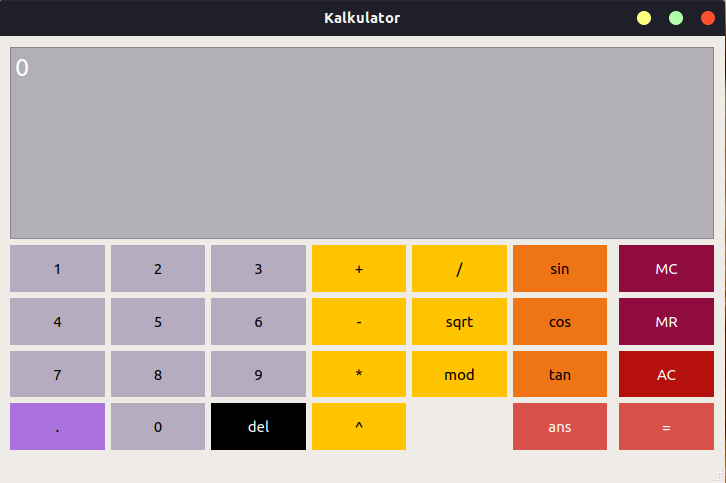

# Vegetable Calculator (with scientific features!)
Tugas Besar 1 Pemrograman Berorientasi Objek

oleh __Kelompok 01 kelas 03__:
- Dimas Lucky Mahendra (13518003)
- Muchammad Ibnu Sidqi (13518072)
- Muhammad Ravid Valiandi (13518099)
- Muhammad Fauzan Rafi Sidiq Widjonarto (13518147)

## Struktur Kode
Struktur Kode dari program adalah sebagai berikut (dengan root adalah folder program):
```
.
├── driver_expression.cpp
├── driver_queue.cpp
├── Exception
│   ├── BaseException
│   │   ├── baseexception.cpp
│   │   └── baseexception.h
│   ├── DecimalModException
│   │   ├── decimalmodexception.cpp
│   │   └── decimalmodexception.h
│   ├── DotOverloadException
│   │   ├── dotoverloadexception.cpp
│   │   └── dotoverloadexception.h
│   ├── InvalidOperatorUseException
│   │   ├── invalidoperatoruseexception.cpp
│   │   └── invalidoperatoruseexception.h
│   ├── NoOperatorException
│   │   ├── nooperatorexception.cpp
│   │   └── nooperatorexception.h
│   ├── RootNegativeException
│   │   ├── rootnegativeexception.cpp
│   │   └── rootnegativeexception.h
│   ├── ZeroDivisionException
│   │   ├── zerodivisionexception.cpp
│   │   └── zerodivisionexception.h
│   └── ZeroModException
│       ├── zeromodexception.cpp
│       └── zeromodexception.h
├── Expression
│   ├── AddExpression
│   │   └── addexpression.h
│   ├── BinaryExpression
│   │   └── binaryexpression.h
│   ├── CosExpression
│   │   └── cosexpression.h
│   ├── DivisionExpression
│   │   └── divisionexpression.h
│   ├── expression.h
│   ├── ModExpression
│   │   └── modexpression.h
│   ├── MultiplyExpression
│   │   └── multiplyexpression.h
│   ├── PowerExpression
│   │   └── powerexpression.h
│   ├── RootExpression
│   │   └── rootexpression.h
│   ├── SinExpression
│   │   └── sinexpression.h
│   ├── SubstractExpression
│   │   └── substractexpression.h
│   ├── TanExpression
│   │   └── tanexpression.h
│   ├── TerminalExpression
│   │   └── terminalexpression.h
│   └── UnaryExpression
│       └── unaryexpression.h
├── kalkulator.cpp
├── kalkulator.h
├── Kalkulator.pro
├── Kalkulator.pro.user
├── kalkulator.ui
├── main.cpp
├── Parser
│   ├── parser.cpp
│   └── parser.h
├── README.md
└── tree.txt

24 directories, 42 files
```
## Cara Compile
1. Download [Qt](https://www.qt.io/download) untuk membuka _project_ dari program kalkulator ini
2. Program ini dibuat di Qt untuk Ubuntu 18.04, sehingga bila ada _error_ yang terjadi mungkin karena _path_ Qt yang harus disesuaikan dengan OS Anda.
3. Buka `kalkulator.pro` di Qt, lalu Build!

## Cara Run
1. Download [Qt](https://www.qt.io/download) untuk membuka _project_ dari program kalkulator ini
2. Program ini dibuat di Qt untuk Ubuntu 18.04, sehingga bila ada _error_ yang terjadi mungkin karena _path_ Qt yang harus disesuaikan dengan OS Anda.
3. Buka `kalkulator.pro` di Qt, lalu Run dengan cara klik <kbd>ctrl</kbd> + <kbd>r</kbd> atau <kbd>command</kbd> + <kbd>r</kbd>.

## Screenshot program
 <br>
*Gambar 1: Kalkulator pada state awal* <br><br>
 <br>
*Gambar 2: Kalkulator saat menerima ekspresi biner* <br><br>
 <br>
*Gambar 3: Kalkulator saat menerima ekspresi uner* <br><br>
 <br>
*Gambar 4: Kalkulator menampilkan pesan kesalahan*